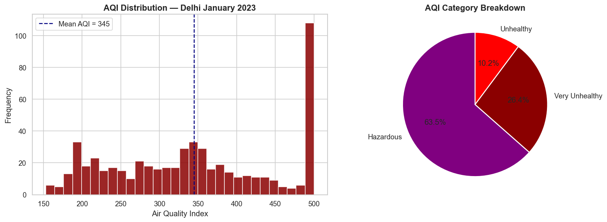
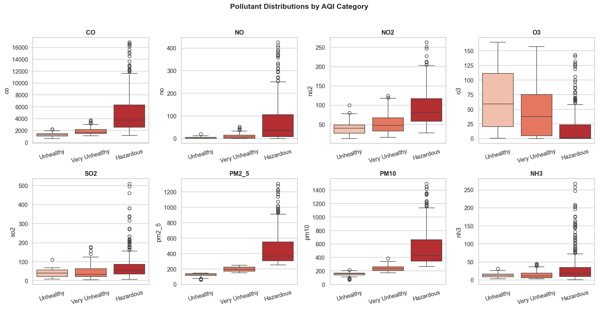
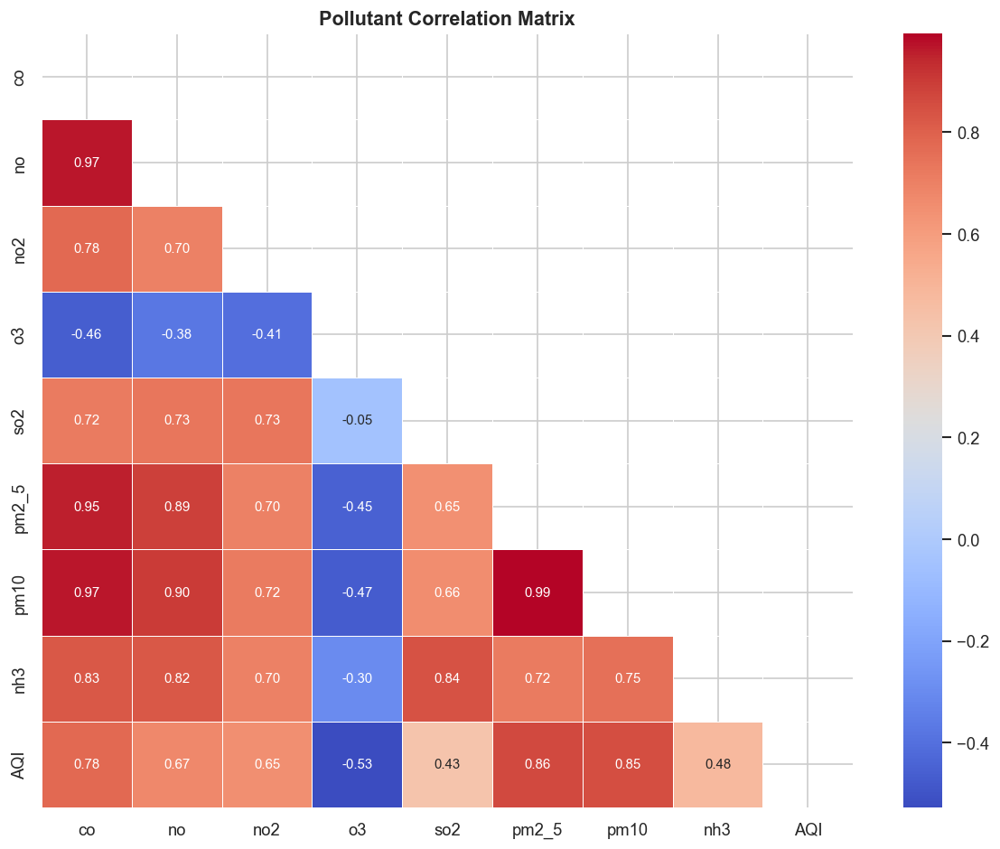
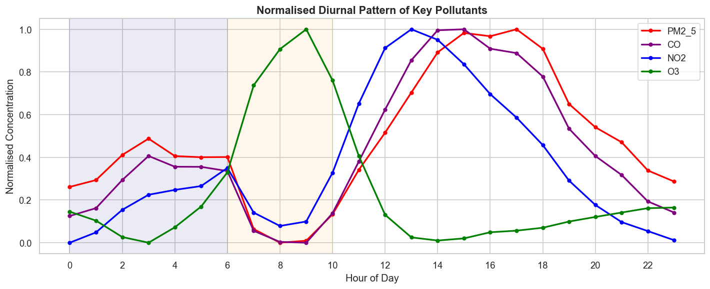
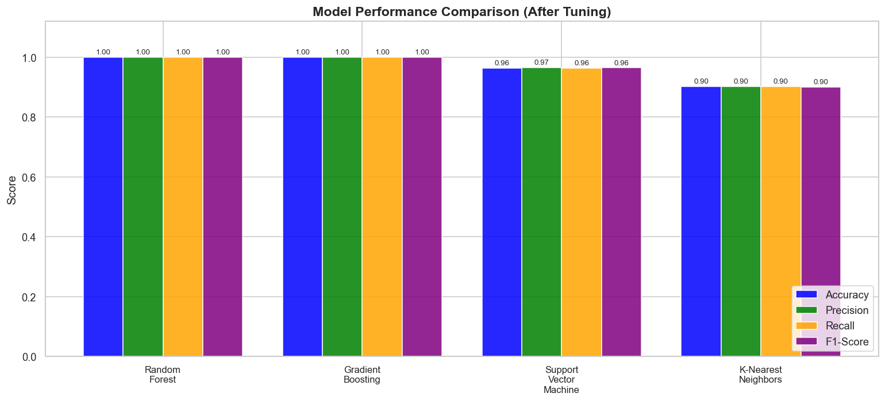
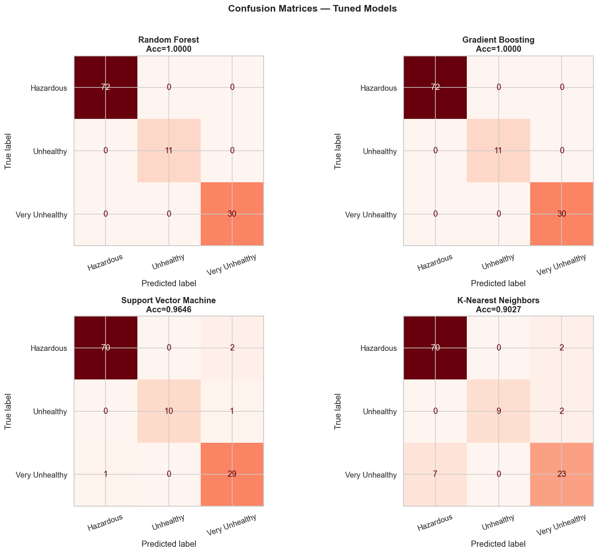
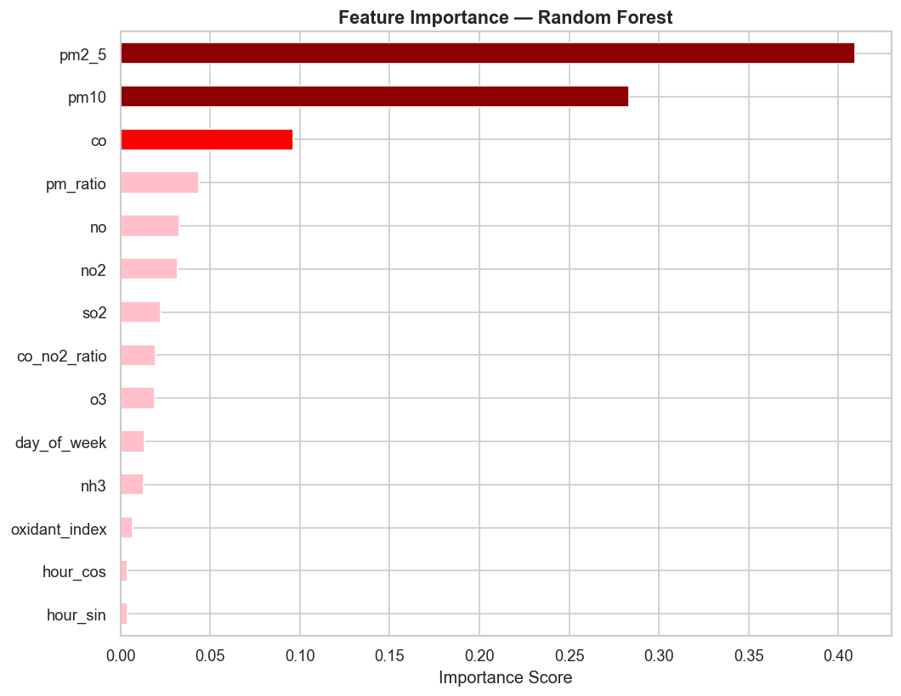

# 🌫️ Delhi Air Quality Hazard Classifier

Predicting AQI hazard categories (Hazardous / Very Unhealthy / Unhealthy) for Delhi using pollutant concentration data and supervised machine learning.

---

## 📌 Overview

Delhi consistently ranks among the most polluted cities in the world. This project analyzes hourly air quality data (Jan 2023) and builds classification models that predict the **AQI hazard category** from raw pollutant readings (PM2.5, PM10, CO, NO, NO2, O3, SO2, NH3).

The pipeline covers full EDA → feature engineering → model training/tuning → evaluation, and compares four classifiers to find the best-performing one.

## 🗂️ Project Structure

```
Delhi-Air-Quality-Hazard-Classifier/
│
├── README.md
├── requirements.txt
├── data/
│   └── delhiaqi.csv                  
├── notebook/
│   └── air_quality_notebook.ipynb    # Full analysis pipeline
├── outputs/
│   ├── eda_aqi_distribution.png
│   ├── eda_boxplots.png
│   ├── eda_correlation.png
│   ├── eda_diurnal.png
│   ├── eval_comparison.png
│   ├── eval_confusion_matrices.png
│   └── eval_feature_importance.png
|── docs/
|   ├── presentation.pptx
|   └── research_paper.docx
├── .gitignore

```

## 📊 Dataset

- **Source:** Hourly air quality readings for Delhi, January 2023
- **Raw features (from CSV):** `co`, `no`, `no2`, `o3`, `so2`, `pm2_5`, `pm10`, `nh3`
- **Target:** AQI Hazard Category (`Hazardous`, `Very Unhealthy`, `Unhealthy`) — AQI is **computed in the notebook** from pollutant concentrations and then binned into these categories; it is not present in the raw CSV.
- **Engineered features (computed in the notebook):** `pm_ratio`, `co_no2_ratio`, `oxidant_index`, `hour_sin`/`hour_cos` (cyclical time encoding), `day_of_week`

## 🔍 Exploratory Data Analysis

**AQI Distribution** — Over 63% of recorded hours fell into the *Hazardous* category, highlighting the severity of Delhi's winter pollution.



**Pollutant Distributions by Category** — PM2.5, PM10, and CO show the sharpest separation across hazard categories.



**Correlation Matrix** — PM2.5 and PM10 are near-perfectly correlated (0.99) and both strongly correlated with AQI (0.86 / 0.85). O3 is the only pollutant negatively correlated with AQI.



**Diurnal Pattern** — Pollutants peak in the afternoon/evening while O3 peaks mid-morning, reflecting photochemical and traffic-related cycles.



## 🤖 Modeling

Four classifiers were trained and tuned using **GridSearchCV**:

| Model | Accuracy | Precision | Recall | F1-Score |
|---|---|---|---|---|
| Random Forest | 1.00 | 1.00 | 1.00 | 1.00 |
| Gradient Boosting | 1.00 | 1.00 | 1.00 | 1.00 |
| Support Vector Machine | 0.9646 | 0.9661 | 0.9646 | 0.9649 |
| K-Nearest Neighbors | 0.9027 | 0.9027 | 0.9027 | 0.9005 |



### Confusion Matrices (Tuned Models)



### Feature Importance (Random Forest)

PM2.5 and PM10 dominate model decisions, together accounting for ~70% of total feature importance — consistent with the correlation analysis above.



## 🛠️ Tech Stack

- **Language:** Python
- **Data Handling:** Pandas, NumPy
- **Visualization:** Matplotlib, Seaborn
- **Machine Learning:** Scikit-learn (Random Forest, Gradient Boosting, SVM, KNN, GridSearchCV)

## ⚙️ How to Run

```bash
git clone https://github.com/muneebulhaq02/Delhi-Air-Quality-Hazard-Classifier.git
cd Delhi-Air-Quality-Hazard-Classifier
pip install -r requirements.txt
jupyter notebook notebook/air_quality_notebook.ipynb
```

## 📈 Key Findings

- Particulate matter (PM2.5, PM10) is by far the strongest predictor of AQI hazard level.
- Tree-based ensemble models (Random Forest, Gradient Boosting) achieve perfect classification on this dataset, while distance-based KNN struggles more with the Hazardous/Very Unhealthy boundary.
- Strong diurnal and inter-pollutant correlation patterns suggest traffic and combustion sources dominate Delhi's winter air quality crisis.

## 📄 License

This project is for academic and educational purposes.
